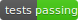

# TTSDS: Text-to-Speech Distribution Score

[](https://pypi.org/project/ttsds)
[](https://github.com/ttsds/ttsds/actions)
[](https://github.com/ttsds/ttsds/actions)

TTSDS is a comprehensive benchmark for evaluating the quality of synthetic speech in Text-to-Speech (TTS) systems. It uses **distributional distances** across multiple **perceptually-motivated** dimensions of speech quality including prosody, speaker identity, and intelligibility by comparing synthetic speech with both real speech and noise datasets.

To see the latest results for TTS systems, check out the [TTSDS website](https://ttsdsbenchmark.com).

## What is TTSDS?

Text-to-Speech Distribution Score (TTSDS) is a novel evaluation framework that:

1. **Measures distributional similarity** between synthetic speech and real speech
2. **Evaluates multiple dimensions** of speech quality
3. **Offers customizable weights** for different evaluation categories
4. **Provides reproducible benchmarks** for TTS systems

TTSDS gives a more comprehensive and nuanced evaluation of synthetic speech than traditional methods, helping researchers and developers better understand the strengths and weaknesses of their TTS systems.

## TTSDS Factors

- Prosody (e.g., pitch, speaking rate)
- Speaker Identity (e.g., speaker verification)
- Intelligibility (e.g., speech recognition)
- Generic Features (e.g., embeddings)
- Environment (e.g., signal-to-noise ratio)

## Quick Links

- [Installation](user-guide/installation.md)
- [Quick Start](user-guide/quickstart.md)
- [Configuration](user-guide/configuration.md)
- [API Reference](reference/benchmarks.md)
- [Contributing Guide](contributing/development.md)
- [Paper](https://arxiv.org/abs/2407.12707)
- [Website](https://ttsdsbenchmark.com)

## Citation

```bibtex
@inproceedings{minixhofer2024ttsds,
  title={TTSDS-Text-to-Speech Distribution Score},
  author={Minixhofer, Christoph and Klejch, Ond{\v{r}}ej and Bell, Peter},
  booktitle={SLT},
  year={2024},
}
``` 